# interior-plan-studio 室内设计出图助手 / Interior Plan Studio

把户型图 / 平面图 / 手绘草图一键转换为 8 种专业室内设计图的 AI 技能（图生图 + 高保真锁定底图）。

Turn any floor plan / hand-drawn sketch into 8 kinds of professional interior design deliverables — via image-to-image generation with high input fidelity (layout & structure locked to the source plan).

## Examples / 实例效果

以下示例基于一套**AI 虚构的公寓户型**生成，不涉及任何真实楼盘。

The examples below are generated from a **fictional AI-generated apartment plan** (no real project involved).

**⓪ 示例底图 · Sample Input Plan**（虚构 128㎡ 三室两厅）

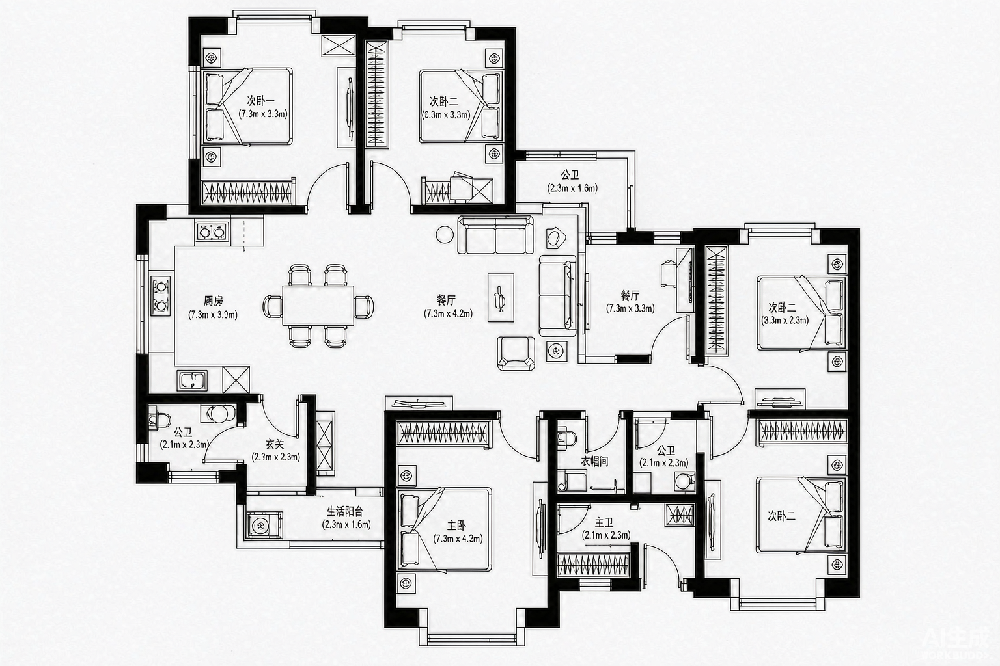

**① 写实材质平面图 · Material Floor Plan**（客厅大理石 / 卧室白橡木地板，布局严格不变）

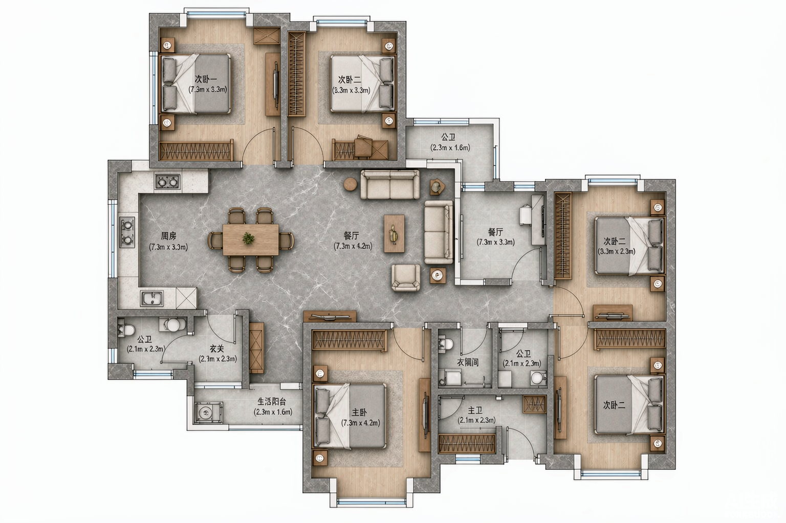

**② 手绘图转 CAD 风格线稿 · Hand Sketch → CAD-Style Drawing**

| 输入 Input | 输出 Output |
|---|---|
| 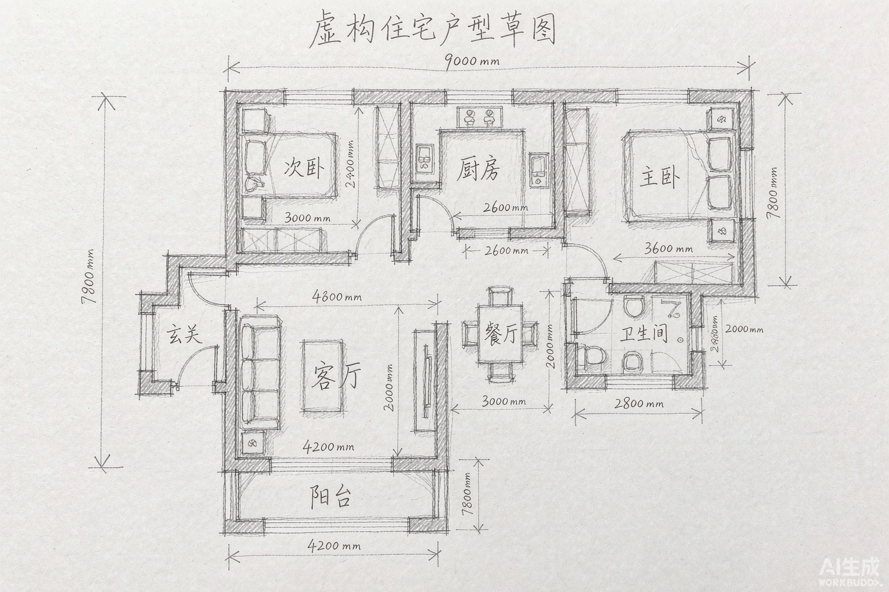 | 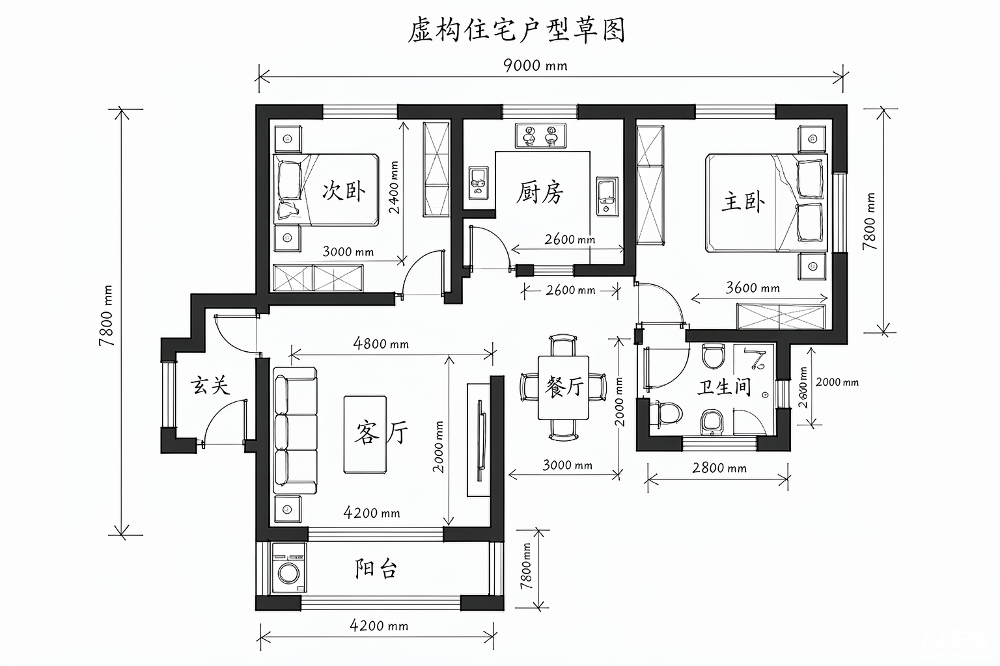 |

**③ 空户型家具布置图 · Furniture Layout for Empty Plans**

| 输入 Input | 输出 Output |
|---|---|
| 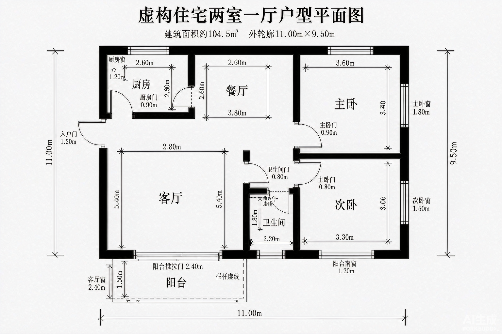 | 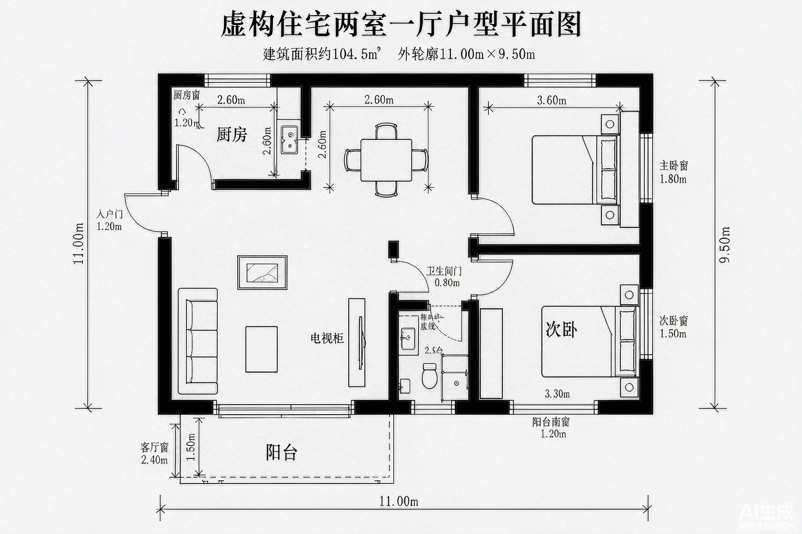 |

**④ 空白平面功能布局 · Functional Zoning**（虚构商铺 → 咖啡厅）

| 输入 Input | 输出 Output |
|---|---|
| 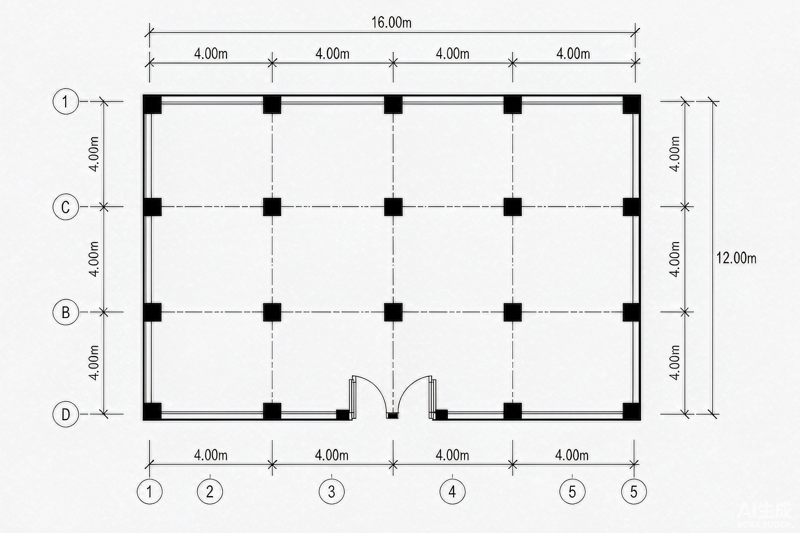 | 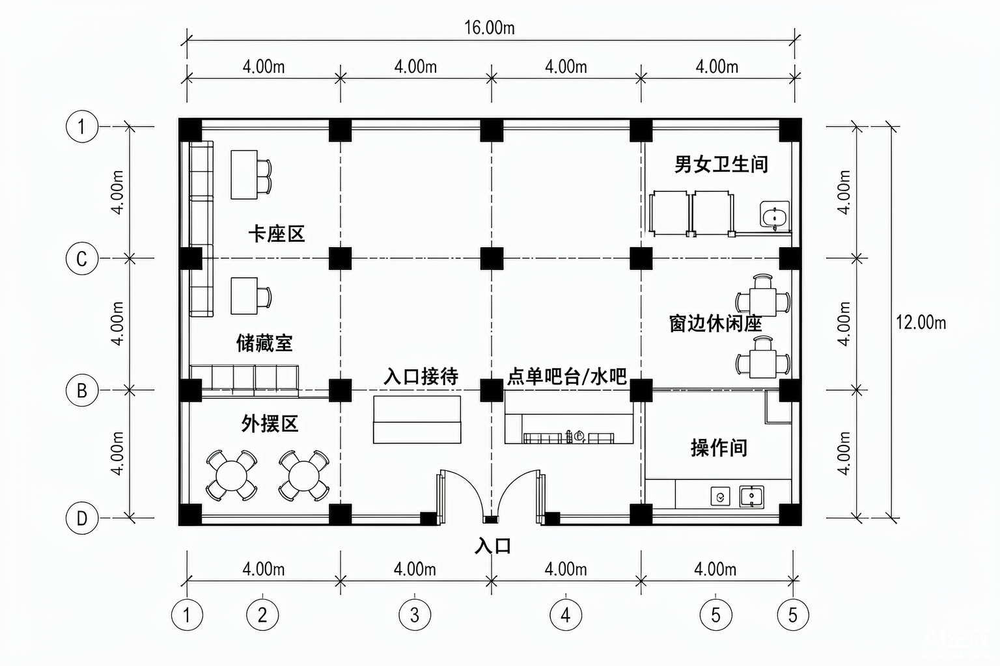 |

**⑤ 家具尺寸与人体尺度分析图 · Human Scale & Dimension Analysis**

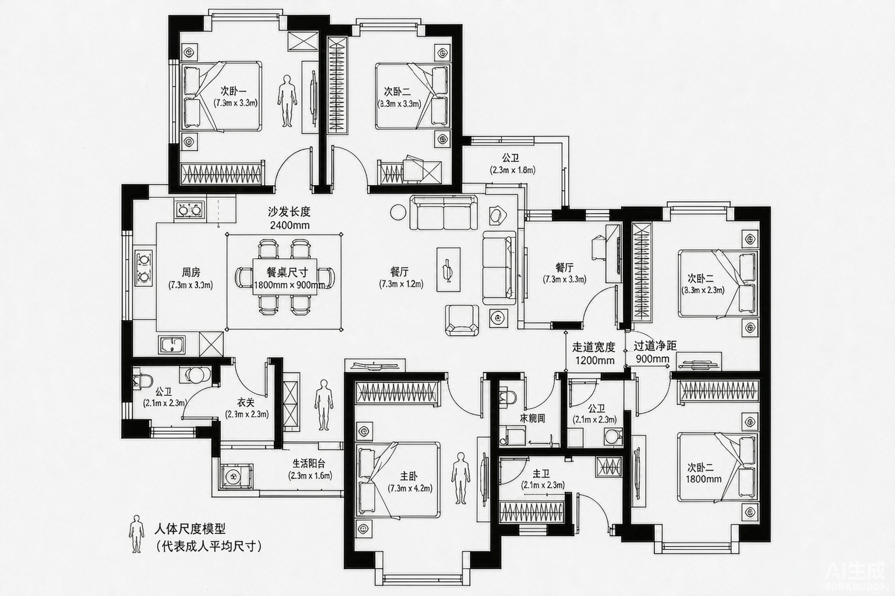

**⑥ 9 页方案汇报 PPT · 9-Page Design Proposal Grid**

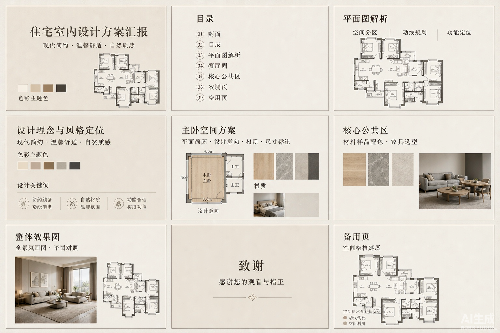

**⑦ 三色动线分析图 · Circulation Analysis**（生活/家务/访客动线 + 功能色块 + 图例）

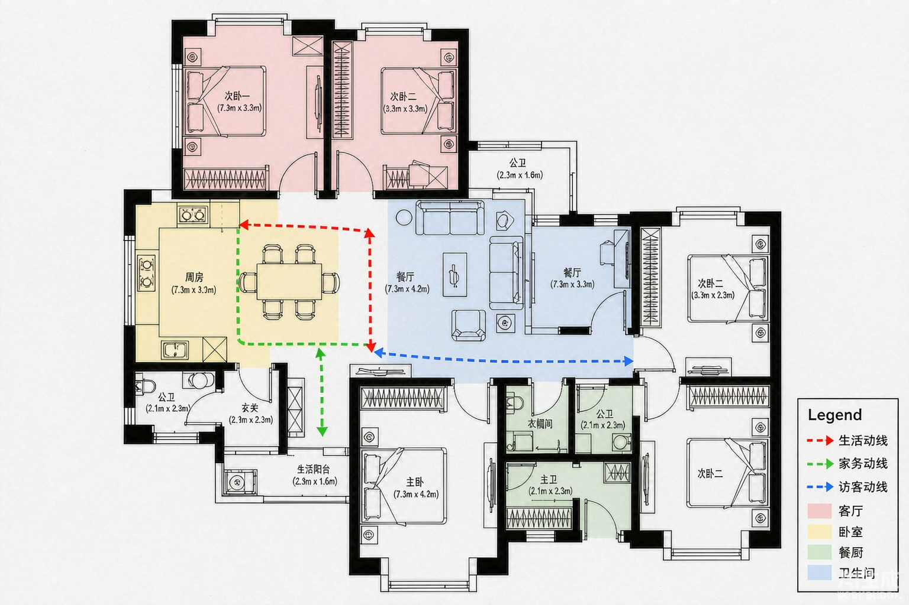

**⑧ 空间区域 4K 实景效果图 · Photorealistic Room Render**（现代简约客厅）

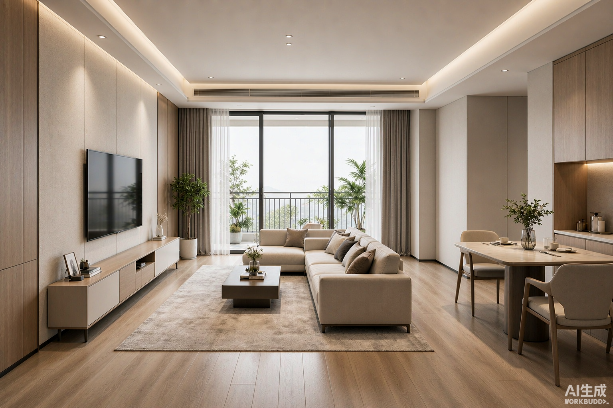

## 8 种输出 / The 8 Modes

| # | 模式 (CN) | Mode (EN) | 适用输入 / Input |
|---|-----------|-----------|------------------|
| 1 | 写实材质平面图 | Material floor plan | 任意户型图 / any floor plan |
| 2 | 手绘图转 CAD 风格线稿 | Hand sketch → CAD-style drawing | 手绘草图/照片 / sketches, photos |
| 3 | 空户型家具布置图 | Furniture layout for empty plans | 有房间名的空户型 / labeled empty plans |
| 4 | 空白平面功能布局 | Functional zoning (café, office…) | 空白建筑平面 / blank architectural plans |
| 5 | 家具尺寸与人体尺度分析图 | Furniture dimension & human scale analysis | 户型平面图 / floor plans |
| 6 | 9 页方案汇报 PPT（九宫格） | 9-page design proposal board | 户型平面图 / floor plans |
| 7 | 三色动线分析图 | 3-color circulation analysis | 户型平面图 / floor plans |
| 8 | 空间区域 4K 实景效果图 | Photorealistic 4K room render | 户型平面图（可框选区域）/ plans with marked zones |

## 安装 / Install

WorkBuddy / CodeBuddy（或任意支持 Agent Skills 的客户端）：

```bash
git clone https://github.com/ethanding9005/interior-plan-studio.git ~/.workbuddy/skills/interior-plan-studio
```

或将 `SKILL.md` + `references/prompts.md` 复制到客户端技能目录 / Or copy `SKILL.md` + `references/prompts.md` into your client's skills directory.

## 使用 / Usage

1. 上传底图（户型图 / 平面图 / 手绘图）/ Upload a floor plan image
2. 说明想要哪种输出（如「转材质平面图，客厅用灰色大理石」）/ Say which mode you want, e.g. "turn this into a material floor plan with grey marble in the living room"
3. 技能自动匹配模板 → 图生图（高保真）→ 出图 → 可局部迭代修改 / The skill matches a prompt template, runs image-to-image with high fidelity, and supports local iteration on previous outputs

## 文件结构 / Structure

```
interior-plan-studio/
├── SKILL.md              # 触发描述 + 工作流 + 模式速查表
├── references/
│   └── prompts.md        # 8 条提示词模板（材质/风格/业态/视角可变量替换）
└── examples/             # 实例图 / sample outputs
```
